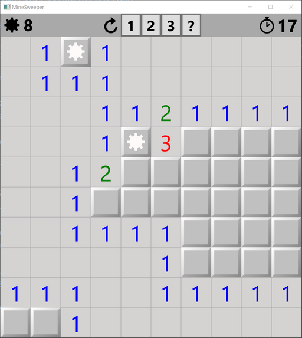

# MineSweeper

---------------------------------------

This is a WPF MVVM implementation of the well known Minesweeper game.
See the [change log](CHANGELOG.md) for changes and road map.

## Features 
- Copy/paste file lists
- Option to detect idle applications (no CPU ticks) and close them

## Errors and questions
Please us the GitHub [Issue function](https://github.com/danielscherzer/MineSweeper/issues/new) to report errors or ask questions.

## Contribute
Check out the [contribution guidelines](CONTRIBUTING.md)
if you want to contribute to this project.

## License
[Apache 2.0](http://www.apache.org/licenses/LICENSE-2.0)

`pocketWatchPathData` icon made by [Icon Fonts](https://www.onlinewebfonts.com/icon/20107) is licensed under CC BY 3.0

`redoPathData` icon made by [simpleicon](https://www.flaticon.com/authors/simpleicon) from [flaticon.com](https://www.flaticon.com/free-icon/redo-circular-arrow_34186) is licensed under CC BY 3.0

